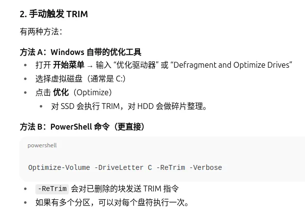

# KVM虚拟机开发记录

## kvm qcow2虚拟磁盘管理

- 空白的虚拟磁盘`qcow2`可以通过`qemu-img create -f qcow2 "${volume}" 80G`产生，这样就不需要提前拷贝磁盘（太大，拷贝很麻烦）
- 当虚拟机为windows的时候，可以通过一下的方式访问qcow2磁盘

```shell
$ modprobe nbd max_part=8
$ qemu-nbd --connect=/dev/nbd0 /path/to/qcow2/image
$ mount -t ntfs3 /dev/nbd0p1 /mnt   #可读可写
```

在`host`删除虚拟机的文件之后，无法使得`qcow2`变小，可以通过如下的方式管理缩小磁盘



## sriov技术

### 技术介绍

`SR-IOV`技术是一种基于`PCI`硬件的虚拟化解决方案, 将`PF`分为多个`VF`.`Single Root I/O Virtualization`缩写.

- PF:A PCIE Physical function
- VF:PCIE virtual functons

下面基于`iq8xxx`系统`I915`来介绍怎么使能、使用`SR-IOV`

### I915功能使能

- 内核使用`intel linux`

经过确认，因为intel的一类显卡支持sr-iov，所以对应的ℹ915驱动包含对应的sr-iov处理。

本次测试使用的为[linux-lntel-lts-5.15.113-rt64](https://github.com/intel/linux-intel-lts/releases/tag/lts-v5.15.113-rt64-preempt-rt-230627T133722Z)

- 确认PCI I915设备是否支持sr-iov

```shell
$ lspci -v
00:02.0 VGA compatible controller: Intel Corporation TigerLake-LP GT2 [Iris Xe Graphics] (rev 01) (prog-if 00 [VGA controller])
	DeviceName: Onboard - Video
	Subsystem: Intel Corporation Device 2212
	Flags: bus master, fast devsel, latency 0, IRQ 143
	Memory at 6000000000 (64-bit, non-prefetchable) [size=16M]
	Memory at 4000000000 (64-bit, prefetchable) [size=256M]
	I/O ports at 3000 [size=64]
	Expansion ROM at 000c0000 [virtual] [disabled] [size=128K]
	Capabilities: [40] Vendor Specific Information: Len=0c <?>
	Capabilities: [70] Express Root Complex Integrated Endpoint, MSI 00
	Capabilities: [ac] MSI: Enable+ Count=1/1 Maskable+ 64bit-
	Capabilities: [d0] Power Management version 2
	Capabilities: [100] Process Address Space ID (PASID)
	Capabilities: [200] Address Translation Service (ATS)
	Capabilities: [300] Page Request Interface (PRI)
	Capabilities: [320] Single Root I/O Virtualization (SR-IOV)
	Kernel driver in use: i915
```

I915使用`Iris Xe Graphics`驱动，该驱动支持`SR-IOV`

- 配置linux

```
enable CONFIG_PCI_IOV (使能i915 sriov)
enable CONFIG_DRM_I915
enable CONFIG_VIRTIO_PCI (虚拟机可以使用对应的驱动)
```

- 如果bios中有sriov开关，则打开sriov
- linux cmdline

```shell
$ cat /proc/cmdline 
BOOT_IMAGE=/bzImage root=PARTUUID=7fc526e8-8fe6-410b-b9bc-5a4c506c1568 rootfstype=erofs rootwait console=tty1 console=ttyS0,115200n8 iomem=relaxed isolcpus=1-N mce=ignore_ce idle=poll intel_idle.max_cstate=0 processor.max_cstate=0 intel.max_cstate=0 processor_idle.max_cstate=0 pcie_asmp=off overlay=yes consoleblank=0 irqaffinity=0 intel_pstate=disable i915.enable_rc6=0 i915.enable_dc=0 i915.disable_power_well=0 i915.enable_execlists=0 i915.powersave=0 nohalt nosmap clocksource=tsc tsc=reliable acpi_irq_nobalance nosoftlockup rc_runlevel=initdefault overlayfs=preboot intel_iommu=on i915.enable_guc=7 i915.max_vfs=7

# intel_iommu: [DMAR] Intel IOMMU driver (DMAR) option
#		on
#			Enable intel iommu driver.
#		off
#			Disable intel iommu driver.
#		igfx_off [Default Off]
#			By default, gfx is mapped as normal device. If a gfx
#			device has a dedicated DMAR unit, the DMAR unit is
#			bypassed by not enabling DMAR with this option. In
#			this case, gfx device will use physical address for
#			DMA.
#		strict [Default Off]
#			Deprecated, equivalent to iommu.strict=1.
#		sp_off [Default Off]
#			By default, super page will be supported if Intel IOMMU
#			has the capability. With this option, super page will
#			not be supported.
#		sm_on
#			Enable the Intel IOMMU scalable mode if the hardware
#			advertises that it has support for the scalable mode
#			translation.
#		sm_off
#			Disallow use of the Intel IOMMU scalable mode.
#		tboot_noforce [Default Off]
#			Do not force the Intel IOMMU enabled under tboot.
#			By default, tboot will force Intel IOMMU on, which
#			could harm performance of some high-throughput
#			devices like 40GBit network cards, even if identity
#			mapping is enabled.
#			Note that using this option lowers the security
#			provided by tboot because it makes the system
#			vulnerable to DMA attacks.
# i915.enable_guc: 	"Enable GuC load for GuC submission and/or HuC load. "
#	"Required functionality can be selected using bitmask values. "
#	"(-1=auto [default], 0=disable, 1=GuC submission, 2=HuC load, "
#	"4=SR-IOV PF)"
# i915.max_vfs: "Limit number of virtual functions to allocate. "
#	"(default: no limit; N=limit to N, 0=no VFs)"
```

- 结果

```shell
$ cd /sys/devices/pci0000:00/0000:00:02.0
$ ls sriov_*
sriov_drivers_autoprobe  sriov_numvfs  sriov_offset  sriov_stride  sriov_totalvfs  sriov_vf_device  sriov_vf_total_msix
$ cat sriov_totalvfs  # 最多可以分为多少个VF，ℹ915.max_vfs设置
7
$ cat sriov_numvfs # 实际生成多少个VF，0表示关闭了sriov供功能
0

# 参考https://github.com/intel/linux-intel-lts/blob/lts-v5.15.113-rt64-preempt-rt-230627T133722Z/Documentation/ABI/testing/sysfs-bus-pci
```

### 使用

```shell
$ cd /sys/devices/pci0000:00/0000:00:02.0
$ cat sriov_numvfs
0
$ lspci 
00:02.0 VGA compatible controller: Intel Corporation TigerLake-LP GT2 [Iris Xe Graphics] (rev 01)
$ echo 7 > sriov_numvfs    # sriov_numvfs = sriov_totalvfs
$ cat sriov_numvfs 
1
$  lspci 
00:02.0 VGA compatible controller: Intel Corporation TigerLake-LP GT2 [Iris Xe Graphics] (rev 01)
00:02.1 VGA compatible controller: Intel Corporation TigerLake-LP GT2 [Iris Xe Graphics] (rev 01)
00:02.2 VGA compatible controller: Intel Corporation TigerLake-LP GT2 [Iris Xe Graphics] (rev 01)
00:02.3 VGA compatible controller: Intel Corporation TigerLake-LP GT2 [Iris Xe Graphics] (rev 01)
00:02.4 VGA compatible controller: Intel Corporation TigerLake-LP GT2 [Iris Xe Graphics] (rev 01)
00:02.5 VGA compatible controller: Intel Corporation TigerLake-LP GT2 [Iris Xe Graphics] (rev 01)
00:02.6 VGA compatible controller: Intel Corporation TigerLake-LP GT2 [Iris Xe Graphics] (rev 01)
00:02.7 VGA compatible controller: Intel Corporation TigerLake-LP GT2 [Iris Xe Graphics] (rev 01)

$ lspci -v
00:02.0 VGA compatible controller: Intel Corporation UHD Graphics (rev 01) (prog-if 00 [VGA controller])
	DeviceName: Onboard - Video
	Subsystem: Intel Corporation Device 2212
	Flags: bus master, fast devsel, latency 0, IRQ 144, IOMMU group 1
	Memory at 6000000000 (64-bit, non-prefetchable) [size=16M]
	Memory at 4000000000 (64-bit, prefetchable) [size=256M]
	I/O ports at 3000 [size=64]
	Expansion ROM at 000c0000 [virtual] [disabled] [size=128K]
	Capabilities: [40] Vendor Specific Information: Len=0c <?>
	Capabilities: [70] Express Root Complex Integrated Endpoint, MSI 00
	Capabilities: [ac] MSI: Enable+ Count=1/1 Maskable+ 64bit-
	Capabilities: [d0] Power Management version 2
	Capabilities: [100] Process Address Space ID (PASID)
	Capabilities: [200] Address Translation Service (ATS)
	Capabilities: [300] Page Request Interface (PRI)
	Capabilities: [320] Single Root I/O Virtualization (SR-IOV)
	Kernel driver in use: i915

00:02.1 VGA compatible controller: Intel Corporation TigerLake-LP GT2 [Iris Xe Graphics] (rev 01) (prog-if 00 [VGA controller])
	Subsystem: Intel Corporation Device 2212
	Flags: bus master, fast devsel, latency 0, IRQ 145, IOMMU group 17
	Memory at 4010000000 (64-bit, non-prefetchable) [disabled] [size=16M]
	Memory at 4020000000 (64-bit, prefetchable) [virtual] [size=512M]
	Capabilities: [70] Express Root Complex Integrated Endpoint, MSI 00
	Capabilities: [ac] MSI: Enable+ Count=1/1 Maskable+ 64bit-
	Kernel driver in use: i915

00:02.2 VGA compatible controller: Intel Corporation TigerLake-LP GT2 [Iris Xe Graphics] (rev 01) (prog-if 00 [VGA controller])
	Subsystem: Intel Corporation Device 2212
	Flags: bus master, fast devsel, latency 0, IRQ 146, IOMMU group 18
	Memory at 4011000000 (64-bit, non-prefetchable) [disabled] [size=16M]
	Memory at 4040000000 (64-bit, prefetchable) [virtual] [size=512M]
	Capabilities: [70] Express Root Complex Integrated Endpoint, MSI 00
	Capabilities: [ac] MSI: Enable+ Count=1/1 Maskable+ 64bit-
	Kernel driver in use: vfio-pci

00:02.3 VGA compatible controller: Intel Corporation TigerLake-LP GT2 [Iris Xe Graphics] (rev 01) (prog-if 00 [VGA controller])
	Subsystem: Intel Corporation Device 2212
	Flags: bus master, fast devsel, latency 0, IRQ 147, IOMMU group 19
	Memory at 4012000000 (64-bit, non-prefetchable) [disabled] [size=16M]
	Memory at 4060000000 (64-bit, prefetchable) [virtual] [size=512M]
	Capabilities: [70] Express Root Complex Integrated Endpoint, MSI 00
	Capabilities: [ac] MSI: Enable+ Count=1/1 Maskable+ 64bit-
	Kernel driver in use: i915

00:02.4 VGA compatible controller: Intel Corporation TigerLake-LP GT2 [Iris Xe Graphics] (rev 01) (prog-if 00 [VGA controller])
	Subsystem: Intel Corporation Device 2212
	Flags: bus master, fast devsel, latency 0, IRQ 148, IOMMU group 20
	Memory at 4013000000 (64-bit, non-prefetchable) [disabled] [size=16M]
	Memory at 4080000000 (64-bit, prefetchable) [virtual] [size=512M]
	Capabilities: [70] Express Root Complex Integrated Endpoint, MSI 00
	Capabilities: [ac] MSI: Enable+ Count=1/1 Maskable+ 64bit-
	Kernel driver in use: i915

00:02.5 VGA compatible controller: Intel Corporation TigerLake-LP GT2 [Iris Xe Graphics] (rev 01) (prog-if 00 [VGA controller])
	Subsystem: Intel Corporation Device 2212
	Flags: bus master, fast devsel, latency 0, IRQ 149, IOMMU group 21
	Memory at 4014000000 (64-bit, non-prefetchable) [disabled] [size=16M]
	Memory at 40a0000000 (64-bit, prefetchable) [virtual] [size=512M]
	Capabilities: [70] Express Root Complex Integrated Endpoint, MSI 00
	Capabilities: [ac] MSI: Enable+ Count=1/1 Maskable+ 64bit-
	Kernel driver in use: i915

00:02.6 VGA compatible controller: Intel Corporation TigerLake-LP GT2 [Iris Xe Graphics] (rev 01) (prog-if 00 [VGA controller])
	Subsystem: Intel Corporation Device 2212
	Flags: bus master, fast devsel, latency 0, IRQ 150, IOMMU group 22
	Memory at 4015000000 (64-bit, non-prefetchable) [disabled] [size=16M]
	Memory at 40c0000000 (64-bit, prefetchable) [virtual] [size=512M]
	Capabilities: [70] Express Root Complex Integrated Endpoint, MSI 00
	Capabilities: [ac] MSI: Enable+ Count=1/1 Maskable+ 64bit-
	Kernel driver in use: i915

00:02.7 VGA compatible controller: Intel Corporation TigerLake-LP GT2 [Iris Xe Graphics] (rev 01) (prog-if 00 [VGA controller])
	Subsystem: Intel Corporation Device 2212
	Flags: bus master, fast devsel, latency 0, IRQ 151, IOMMU group 23
	Memory at 4016000000 (64-bit, non-prefetchable) [disabled] [size=16M]
	Memory at 40e0000000 (64-bit, prefetchable) [virtual] [size=512M]
	Capabilities: [70] Express Root Complex Integrated Endpoint, MSI 00
	Capabilities: [ac] MSI: Enable+ Count=1/1 Maskable+ 64bit-
	Kernel driver in use: i915
```

参考：

https://wiki.archlinux.org/title/QEMU/Guest_graphics_acceleration#SR-IOV

## KVM实现pci直通

1. 首先按照[如何安装window虚拟机](http://os.hcfa.cn:4000/iq800/next/%E5%85%A5%E9%97%A8%E6%8C%87%E5%8D%97/%E7%B3%BB%E7%BB%9F%E5%AE%89%E8%A3%85/KVM)安装好虚拟机

### 真实的PCI

连接某一个pci设备，因为有四个网口，研究的时候以网口为例。

开启虚拟机的时候，会出现以下问题，

```shell
host doesn't support passthrough of host pci devices
```

下面提供解决方案

- 在bios中打开VT-D，VT-X等等开关，像IQ8xx中有VT-D开关需要开启
- 

```shell
$ cat /proc/cmdline 
BOOT_IMAGE=/boot/vmlinuz-lts root=/dev/sda3 ro modules=sd-mod,usb-storage,ext4 quiet rootfstype=ext4 intel_iommu=on iommu=pt i915.enable_guc=7 i915.max_vfs=7 vfio_iommu_type1.allow_unsafe_interrupts=1

# intel_iommu: 参考上面
# 	iommu=		[X86]
#		off
#		force
#		noforce
#		biomerge
#		panic
#		nopanic
#		merge
#		nomerge
#		soft
#		pt		[X86]
#		nopt		[X86]
#		nobypass	[PPC/POWERNV]
#			Disable IOMMU bypass, using IOMMU for PCI devices.

$ lsmod 
Module                  Size  Used by
vfio_pci               16384  1
vfio_pci_core          65536  1 vfio_pci
vfio_virqfd            16384  1 vfio_pci_core
vfio_iommu_type1       40960  1
vfio                   36864  5 vfio_pci_core,vfio_iommu_type1

$ ls /sys/kernel/iommu_groups/
0   1   10  11  12  13  14  15  16  17  18  19  2   3   4   5   6   7   8   9

$ dmesg
[    0.742042] DMAR: Host address width 39
[    0.742043] DMAR: DRHD base: 0x000000fed90000 flags: 0x0
[    0.742049] DMAR: dmar0: reg_base_addr fed90000 ver 4:0 cap 1c0000c40660462 ecap 29a00f0505e
[    0.742052] DMAR: DRHD base: 0x000000fed91000 flags: 0x1
[    0.742058] DMAR: dmar1: reg_base_addr fed91000 ver 1:0 cap d2008c40660462 ecap f050da
[    0.742062] DMAR: RMRR base: 0x00000047000000 end: 0x0000004f7fffff
[    0.742069] DMAR: No ATSR found
[    0.742069] DMAR: No SATC found
[    0.742070] DMAR: IOMMU feature fl1gp_support inconsistent
[    0.742071] DMAR: IOMMU feature pgsel_inv inconsistent
[    0.742072] DMAR: IOMMU feature nwfs inconsistent
[    0.742072] DMAR: IOMMU feature dit inconsistent
[    0.742073] DMAR: IOMMU feature sc_support inconsistent
[    0.742073] DMAR: IOMMU feature dev_iotlb_support inconsistent
[    0.742076] DMAR: dmar0: Using Queued invalidation
[    0.742085] DMAR: dmar1: Using Queued invalidation
[    0.742128] Unpacking initramfs...
[    0.742133] Initramfs unpacking failed: invalid magic at start of compressed archive
[    0.742258] pci 0000:00:00.0: Adding to iommu group 0
[    0.742269] pci 0000:00:02.0: Adding to iommu group 1
[    0.742282] pci 0000:00:08.0: Adding to iommu group 2
[    0.742297] pci 0000:00:0d.0: Adding to iommu group 3
[    0.742314] pci 0000:00:14.0: Adding to iommu group 4
[    0.742324] pci 0000:00:14.2: Adding to iommu group 4
[    0.742348] pci 0000:00:15.0: Adding to iommu group 5
[    0.742356] pci 0000:00:15.1: Adding to iommu group 5
[    0.742364] pci 0000:00:15.2: Adding to iommu group 5
[    0.742375] pci 0000:00:15.3: Adding to iommu group 5
[    0.742387] pci 0000:00:16.0: Adding to iommu group 6
[    0.742397] pci 0000:00:17.0: Adding to iommu group 7
[    0.742414] pci 0000:00:19.0: Adding to iommu group 8
[    0.742423] pci 0000:00:19.1: Adding to iommu group 8
[    0.742436] pci 0000:00:1c.0: Adding to iommu group 9
[    0.742450] pci 0000:00:1c.5: Adding to iommu group 10
[    0.742462] pci 0000:00:1c.6: Adding to iommu group 11
[    0.742478] pci 0000:00:1e.0: Adding to iommu group 12
[    0.742488] pci 0000:00:1e.3: Adding to iommu group 12
[    0.742515] pci 0000:00:1f.0: Adding to iommu group 13
[    0.742525] pci 0000:00:1f.3: Adding to iommu group 13
[    0.742535] pci 0000:00:1f.4: Adding to iommu group 13
[    0.742545] pci 0000:00:1f.5: Adding to iommu group 13
[    0.742554] pci 0000:00:1f.6: Adding to iommu group 13
[    0.742567] pci 0000:01:00.0: Adding to iommu group 14
[    0.742584] pci 0000:02:00.0: Adding to iommu group 15
[    0.742596] pci 0000:03:00.0: Adding to iommu group 16
[    0.742699] DMAR: Intel(R) Virtualization Technology for Directed I/O
```

### sriov vfs

根据真正的PCIE设置之后，选择sriov出来的虚拟pcie时，会出现以下的问题

```shell
VFIO: FAILED TO SET IOMMU FOR CONTAINER: OPERATION NOT PERMITTED
$ dmesg
[  522.129925] vfio_iommu_type1_attach_group: No interrupt remapping support.  Use the module param "allow_unsafe_interrupts" to enable VFIO IOMMU support on this platform
```

在cmdline中添加`vfio_iommu_type1.allow_unsafe_interrupts=1`即可