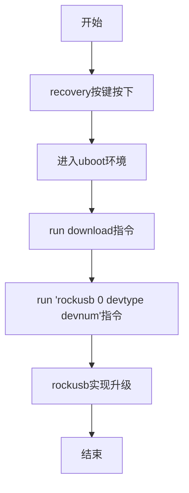

# 瑞芯微系统开发学习

- `parameter.txt`保存了分区信息
    - `0x00003000@0x00002000(uboot)`: `0x00002000`是偏移量， `0x00003000`是分区大小，`(uboot)`是分区名字
- `uboot`升级过程整理

```mermaid
graph TD

A[开始]

B[结束]

A-->C[recovery按键按下]-->D[进入uboot环境]

D-->E[run download指令]-->F[run 'rockusb 0 devtype devnum'指令]

F-->G[rockusb实现升级]-->B
```

- sdk中的buildroot/config/rockchip存在rockchip的配置 
